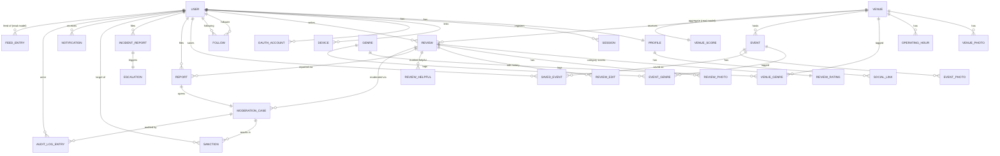

# ClubScan — Phase 2: Database Design

> **Status:** Phase 2 of 8 · **Depends on:** Phase 1 · **DB:** PostgreSQL 16 · **ORM:** Prisma
>
> Defines the relational model, ER diagram, indexing/partitioning strategy, and the canonical
> Prisma schema. The Prisma schema in `clubscan/backend/prisma/schema.prisma` is the
> machine-readable source of truth; this document is its rationale.

---

## 1. Modeling Principles

1. **Bounded contexts → schema regions.** Tables are grouped by the contexts from Phase 1.
   In a modular monolith they share one Postgres database; module code only touches its own
   tables through repository interfaces (no cross-module joins in app code — joins that cross
   contexts happen in dedicated read models).
2. **UUID v7 primary keys** (`@db.Uuid`, app-generated, time-ordered) — globally unique, safe
   to expose, index-friendly, shard-ready. Avoid leaking sequential counts.
3. **Soft deletes** (`deletedAt`) for user-generated content (reviews, profiles) to support
   moderation, audit, and GDPR workflows; hard delete on data-protection request.
4. **Timestamps everywhere** (`createdAt`, `updatedAt`) with DB defaults.
5. **Money/scores never floated for storage of truth.** Ratings are small ints (1–5);
   composite scores stored as `Decimal` in read models.
6. **Append-only tables** for `AuditLogEntry` and `AnalyticsEvent` (immutable, partitioned by
   time at scale).
7. **JSONB for open-ended/extensible** attributes (social links, notification payloads, AI
   verdict details) — but anything queried/filtered gets a real column + index.
8. **Geospatial:** store `latitude`/`longitude` as `Decimal`; add PostGIS `geography(Point)`
   via migration for radius search (Prisma `Unsupported` type + raw SQL for `ST_DWithin`).
9. **Enums in DB** for closed sets (roles, statuses, venue types) for integrity + clarity.
10. **CQRS read models** (`VenueScore`, `FeedEntry`, search projections) are denormalized and
    rebuilt from domain events — never the write-side source of truth.

---

## 2. Entity-Relationship Diagram

> A rendered PNG/SVG is generated in CI from this Mermaid block (Phase 5). The Prisma schema
> is authoritative for exact columns.

---

## 3. Table Inventory by Context

### 3.1 IAM
- **users** — auth identity: `email` (unique, citext), `passwordHash` (nullable for OAuth-only),
  `emailVerifiedAt`, `role` (enum), `status` (enum: ACTIVE/SUSPENDED/BANNED/SHADOW_BANNED/DELETED),
  `reputationScore` (denormalized cache from Reputation), timestamps, `deletedAt`.
- **oauth_accounts** — `provider` (GOOGLE/APPLE), `providerAccountId`, unique (provider, providerAccountId).
- **sessions** — refresh-token sessions: `refreshTokenHash`, `deviceId`, `expiresAt`,
  `revokedAt`, `ip`, `userAgent`. Rotation: each refresh replaces the hash (reuse detection).
- **devices** — `pushToken` (FCM), `platform` (IOS/ANDROID), `lastSeenAt`, `name`.
- **email_verification_tokens**, **password_reset_tokens** — single-use, hashed, TTL.

### 3.2 Profile & Reputation
- **profiles** — 1:1 with user: `username` (unique, citext), `displayName`, `bio`,
  `avatarUrl`, `verificationStatus` (enum), `isPrivate`. Reputation lives on `users` as a
  cached score; the ledger is **reputation_events** (append-only deltas with reason).
- **social_links** — `platform`, `url`.
- **follows** — (`followerId`, `followingId`) composite unique; self-follow forbidden.

### 3.3 Venue Catalog
- **venues** — `name`, `slug` (unique), `description`, `type` (enum CLUB/BAR/FESTIVAL/EVENT/LOUNGE),
  address fields, `city`, `country`, `latitude`, `longitude`, `capacity`, `status`
  (DRAFT/PUBLISHED/CLOSED), `coverPhotoUrl`. PostGIS point added via migration.
- **venue_photos**, **operating_hours** (per weekday open/close, supports overnight),
  **genres** (master), **venue_genres** (M:N).
- **events** — belongs to venue: `title`, `description`, `startsAt`, `endsAt`, `lineup` (JSONB),
  `ticketUrl`, `coverPhotoUrl`, `status`. **event_photos**, **event_genres**.
- **saved_events** — (`userId`, `eventId`) unique.

### 3.4 Review & Scoring
- **reviews** — (`userId`, `venueId`) **unique** (one editable review per user/venue),
  `body`, `status` (PENDING/PUBLISHED/HELD/REMOVED), `moderationStatus`, `language`,
  `helpfulCount` (cache), `deletedAt`.
- **review_ratings** — 1:1 with review, the 9 category small-ints (1–5).
- **review_photos**, **review_edits** (immutable snapshots for edit history),
  **review_helpful** ((`userId`,`reviewId`) unique).
- **venue_scores** *(CQRS read model)* — per venue: composite `score` (Decimal 0–100),
  per-category weighted averages, `reviewCount`, `lastComputedAt`. Rebuilt from events.

### 3.5 Moderation & Trust
- **reports** — polymorphic target (`targetType` enum REVIEW/USER/VENUE/EVENT, `targetId`),
  `reason` (enum), `details`, `reporterId`, `status`.
- **moderation_cases** — opened from reports/AI flags: `state`, `assignedModeratorId`,
  `aiVerdict` (JSONB), `resolution`, `resolvedAt`.
- **sanctions** — `targetUserId`, `type` (WARNING/TEMP_BAN/PERMA_BAN/SHADOW_BAN/CONTENT_REMOVAL),
  `reason`, `expiresAt`, `issuedById`, `caseId`.

### 3.6 Safety & Incidents
- **incident_reports** — `reporterId`, `venueId?`, `category` (HARASSMENT/VIOLENCE/
  DISCRIMINATION/UNSAFE_ENVIRONMENT/OTHER), `severity`, `description`, `occurredAt`,
  `isAnonymous`, `state`. **Access-restricted** (moderation/safety roles only).
- **escalations** — `incidentId`, `level`, `slaDueAt`, `escalatedAt`, `handledById`, `outcome`.

### 3.7 Notifications & Feed
- **notifications** — `userId`, `type`, `payload` (JSONB), `readAt`, `sentPush` (bool).
- **feed_entries** *(read model)* — `userId` (owner of feed), `actorId`, `verb`,
  `objectType`, `objectId`, `createdAt`. Fan-out-on-write for normal accounts.

### 3.8 Analytics & Shared Kernel
- **analytics_events** *(append-only, time-partitioned)* — `type`, `userId?`, `sessionId`,
  `properties` (JSONB), `occurredAt`. Source for CTR/engagement/retention.
- **audit_log_entries** *(append-only)* — `actorId`, `action`, `targetType`, `targetId`,
  `metadata` (JSONB), `ip`, `createdAt`. Written for every privileged action.
- **media_assets** — `ownerId`, `bucket`, `key`, `mime`, `size`, `status` (PENDING/READY),
  `width`, `height`. Photos reference assets; direct-to-S3 presigned uploads.
- **feature_flags**, **app_config** (score weights, thresholds — single JSONB row, versioned).

---

## 4. Indexing & Performance Strategy

| Concern | Strategy |
|---|---|
| Geo radius ("near me") | PostGIS `geography(Point,4326)` + GiST index; `ST_DWithin` |
| Venue/user/event search | `pg_trgm` GIN on name/title/username; full-text `tsvector` GIN on description/body |
| Venue listing & sort | composite indexes on (`city`,`status`), (`type`,`status`); score sort via `venue_scores` |
| Feed reads | index `feed_entries(userId, createdAt DESC)` |
| Reviews per venue | index `reviews(venueId, status, createdAt DESC)` |
| One review per user/venue | unique (`userId`,`venueId`) |
| Follows graph | unique (`followerId`,`followingId`); index both directions |
| Sessions lookup | index `sessions(userId)`, unique active `refreshTokenHash` |
| Reports queue | index `moderation_cases(state, createdAt)` |
| Append-only growth | range partition `analytics_events`/`audit_log_entries` by month at scale |
| Hot reads | Redis cache for venue detail + `venue_scores`, sessions, rate-limit counters |

---

## 5. Data Integrity & Lifecycle

- **Referential integrity** via FKs; `ON DELETE` chosen per relation (e.g. cascade
  review_ratings with review; restrict venue delete if it has events).
- **Soft delete** for reviews/profiles → excluded from public reads via repository default
  scope; retained for audit; purged on GDPR/KVKK erasure with audit entry.
- **Score recompute** is idempotent and event-driven; `venue_scores.lastComputedAt` guards
  stale writes.
- **Token hygiene:** verification/reset/refresh tokens stored hashed (never plaintext), TTL'd,
  single-use; refresh rotation with reuse detection revokes the whole session family.

---

## 6. Migration & Seed Strategy

- Prisma Migrate for schema; PostGIS + extensions (`citext`, `pg_trgm`, `uuid`/pgcrypto) added
  in an initial SQL migration.
- `Unsupported("geography(Point, 4326)")` column + raw SQL GiST index in migration; geo
  queries via `prisma.$queryRaw` in the Venue repository.
- Seed script: genres master list, app_config (default score weights from Phase 1 §4.2),
  a super-admin (env-driven), demo venues/events for dev only.

---

## 7. Prisma Schema

The canonical schema is committed at **`clubscan/backend/prisma/schema.prisma`** (this phase).
It implements every table above with enums, relations, indexes, and CQRS read models.

*End of Phase 2. Proceeding to Phase 3: Backend Architecture.*
